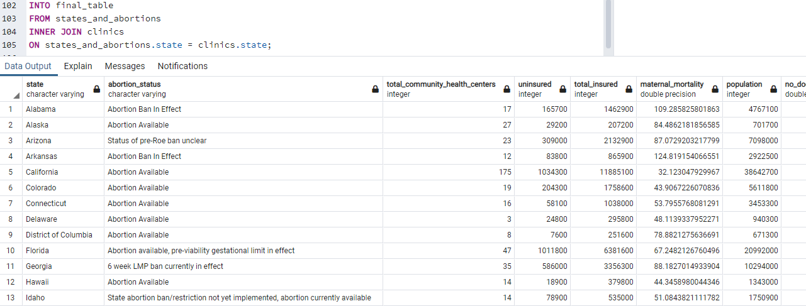
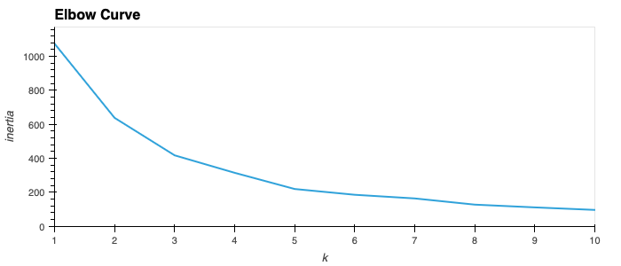
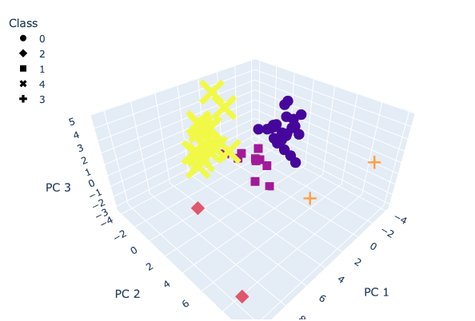
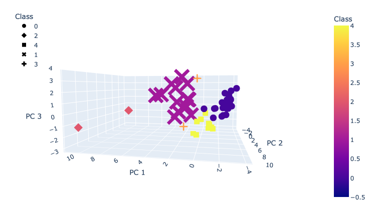
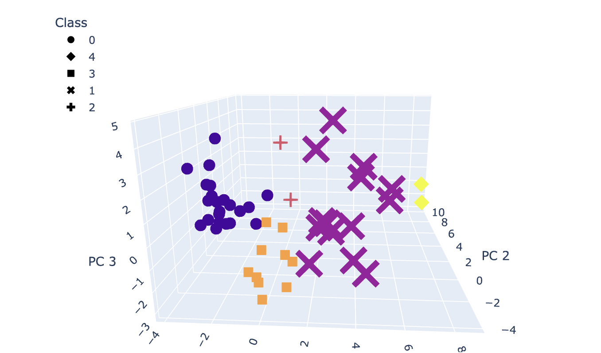
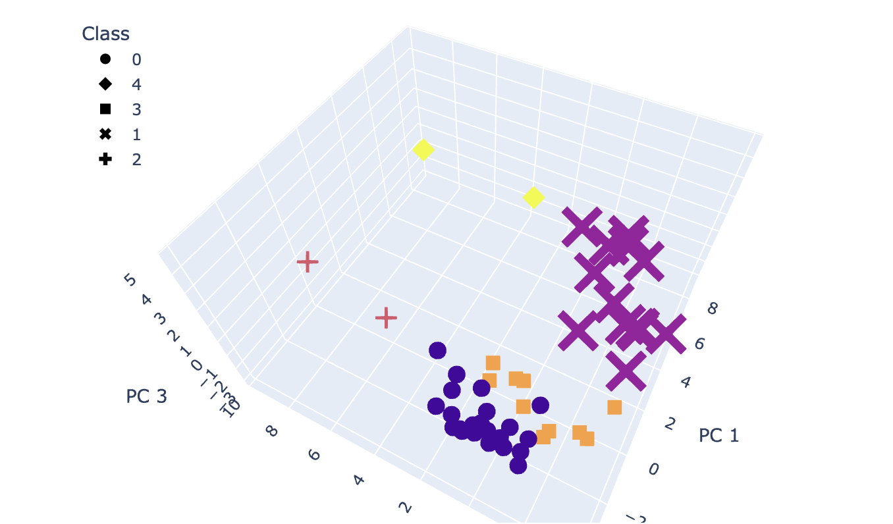
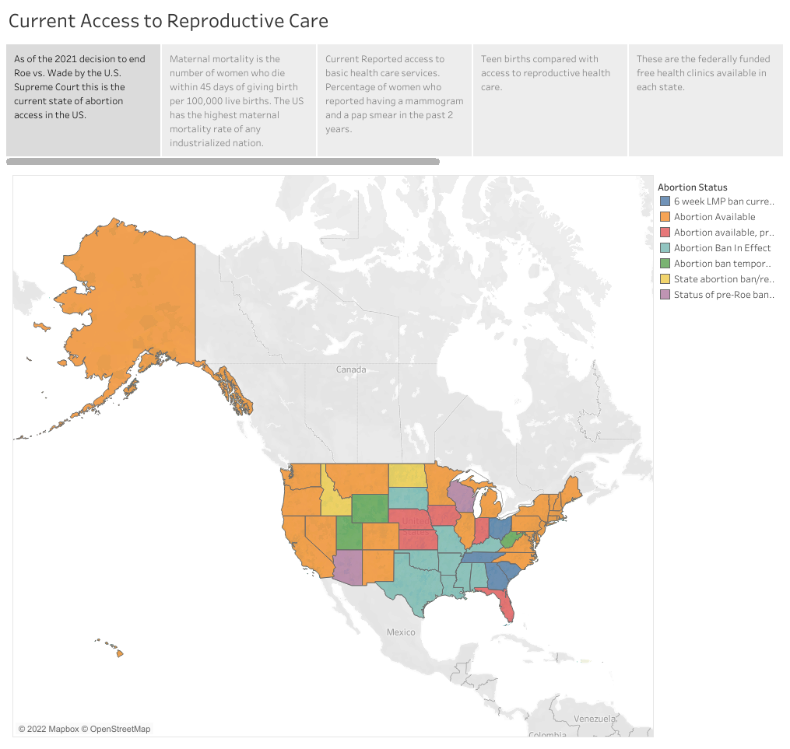

# Table of Contents 

<!-- vscode-markdown-toc -->
* [Overview](#Overview)
* [Data](#Data)
* [Machine Learning](#Machine_Learning)
* [Dashboard](#Dashboard)
* [Further Study](#AdditionalStudy)
* [Additional Resources](#AdditionalResources)

<!-- vscode-markdown-toc-config
	numbering=true
	autoSave=true
	/vscode-markdown-toc-config -->
<!-- /vscode-markdown-toc -->

# Overview

The purpose of this project is to identify the current state of access to reproductive health available in the United States. 

## Key Questions
* Which states have adequate access to reproductive health services?
* Which states lack access to reproductive health services?
* Where are locations that would benifit from reproductive health centers to address the lack of access to care?

# Data
### Preliminary Sources:

* https://crisispregnancycentermap.com/

    Data was scraped to identify centers that do not actually provide any reproductive health services. 

* https://www.kff.org/state-category/womens-health/

    Data pertaining to indicators of health access to care, including insurance status, preventitive care, abortion access, teen pregnancy, maternal mortality.

* https://www.plannedparenthood.org/
    
    Data pertaining to current planned parenthood clinics.

* https://www.census.gov/geographies/reference-files/2010/geo/state-area.html

    Census data showing the geography land area of each state. 

* https://data.guttmacher.org/states

    All abortion data per state for number of abortions, out of state travel for abortions, state of abortion occurrence.  

### Cleaned Data

 We looked through the rows and columns, checking for any data that did not seem resonable, we discussed any missing data and the best approach for each catagory. For example, California and New Hampshire stopped collecting abortion data in 1997 and Maryland stopped collecting in 2006. Guttmacher Institute conducts its own survey with known abortion clinics to provide data on abortions for these states which we inserted into our abortions table. The data from KFF, Guttmacher, Planned Parenthood, and Crisis Pregnancy Center Map was cleaned using pandas in jupyter notebook and Excel/Google Sheets. These files were then made into four tables to create our ERD.

### ERD
The data is organized into databases as followed: 

*Reproductive Health ERD*

This database began with four tables: health_data from KFF, abortions_data from Guttmacher, clinics data from Crisis Pregnancy Centers and Planned Parenthood, and land_area from the Census. These four tables were imported into pgAdmin and joined using a INNER JOIN SQL statements. The final table was then exported to be used for machine learning. Our SQL Alchemy connections can be found in the jupyter notebooks titled Provisional_Machine_Learning_Model, Cleaning_Abortions_Guttmacher, Clustering, and MLM_MLR. 

### Data Exploration 
The preliminary data sources were download individually for each independent variable. The data was then cleaned. The health data collected was organized into one table (health_data).  The data for crisis centers and current reproductive clinics (clinics) was scraped from the web.  Abortion data (abortions) was downloaded from Guttmarker. Additionally, a table from the Census was created to claculate population and land-area of each state(land_area). The data was than cleaned and unneeded or empty cells were removed. Data between the tables was standardized for lables and state names. 

### Data Processing 
The database contains 51 rows of data (50 states + Washington D.C.) and 26 columns. Those columns are:
- Abortion Policy Tracker which contains a brief summary of each states' abortion policy as of August 2, 2022. Data is reported as categorical with 6 categories.
- Community Health Centers which are federally-funded health clinics that also provide women's health services. Data is reported as integers - the number of clinics in 2020.
- Health Insurance Coverage of Women Ages 19 to 64. Insured women reported receive insurance through: employers, non-group, Medicaid, Medicare, military. Some women were also reported as uninsured. Data is reported as integers in 2020.
- Maternal mortality rate was manually calculated from two data sets. One contained maternal deaths for the years 2018 to 2020 and the other number of live births for 2020. We divided maternal deaths by total births and multiplied by 100,000.
- Population reported as integers for 2019.
- The percentage of women who reported not seeing a doctor in the past 12 months due to cost for 2020.
- The percentage of women age 40 and older who report having had a mammogram within the past two years for 2020.
- The percentage of women who reported having no personal doctor or health care provider in 2020.
- The percentage of women ages 18 to 64 who reported having a pap smear within the past three years from 2018 to 2020.
- The state requirements as of May 1, 2022 for insurance coverage of contraceptives including: prescription contraception, over-the-counter methods, male sterilization, female sterilization, and prohibiting cost sharing.
- Teen birth rate per 1,000 teens ages 15-19 in 2020. 
- Distribution of total population by federal poverty level for those 200% and below for 2019.
- Abortion data providing percentages of all U.S. abortions by state of occurrence for 2020, percentage of residents obtaining abortions who traveled out of state for care in 2020, the number of abortions by state of occurrence for 2020, and the number of abortions by state of residence for 2020.
- Clinics and levels of services provided: no services (known as fake pregnancy centers), few services, restricted services, and full service.
- Land area by square kilometers for each state. 

### Data Analysis
 The prelimary data was analyzed as a team. As there are only 51 states it is resonable to do the prelimanary work manually using Excel. Further analysis was done in Jupyter Notebook by using a clustering algorithm, and then a regression model. 

# Machine Learning
### Model choice
- Two machine learning models were used: clustering and regression. K-means clustering was selected because of its ease and quick running time and linear regression was chosen because there are multiple independent variables which make this model the most logial to determin the number of clinics that each state needs to add.
- Limitations: The k-means algorithm is better suited when there is a known number of clusters, although an elbow curve was used to provide insight into the best number of clusters to use. When using all the independent variables for the linear regression, the output for the model prediction is not logical. We recognized that not all variables were completely independent of each other, which is discussed further below. 
- Benefits: This model allows us to look at multiple data sources 

### Preliminary 
States were first clustered based on existing conditions to identify a scale of best quality to worst. The clustering process was as follows:

Preprocessed and Scaled the Data on the Clustering.ipynb
- Imported dependencies: Pandas, hvplot, Plotly Express, and SciKit Learn’s Standard Scaler, PCA, and KMeans. 
- Preprocessed the data by converting categorical data to numerical data using Panda’s get_dummies. 
- Standardized the full dataset using SciKit Learn’s StandardScaler (because some features measured in the millions and others in fractions).
- Reduceded dimensions using PCA to three principal components
- Created an elbow curve with 3 principal components to determine the best value for K-means clustering. 

K-means Clustering
- The elbow curve showed that the best options for clustering were 3 or 5, and we selected 5 and initialized the K-means model with n_clusters=5 to provide a better range of quality to group against. 
- Created a new DataFrame including predicted clusters (titled Class), the principal components, and original features. 
- Used Plotly Express to create a 3D-Scatter with the PCA data as the x, y, and z axes. Hover text was added to easily identify each state’s name and current abortion status.  
- Three distinct clusters formed, and two clusters of what appeared to be outliers. 
- Exported the DataFrame used to create the 3D-Scatter plot to Excel to further analyze the groupings. 
- Class 4 contained New York and California and in evaluating their features, we determined that that was the top performing outlier cluster for existing reproductive health care. 
- The same process was used to evaluate the remaining clusters and found the true order of existing care from best to worst: Class 4, Class 1, Class 3, Class 0, and the worst cluster outlier of Class 2 - Texas and Florida.

  

- Preliminary feature engineering and feature selection: all data was used. 

### Data Split, Train and Test
Once the clustered data was analyzed, multi-linear regression was used in the following steps on the MLM_MLR.ipynb: 
- Imported dependencies: NumPy, Pandas, PyPlot. And SciKit Learn’s Linear Regression and StandardScaler. 
- Preprocessed the data by removing the PCA features and binary features and converted the categorical data (abortion status) to numerical. 
- Split the data into two sets: train and test. The train dataset included the states from the two best performing clusters: Class 4 and Class 1; the test dataset included the remaining states from Class 0, 2, and 3. This was used to predict a best-case scenario for poorer performing states.  
- Used StandardScaler to scale all data.
- Fit the training data to create our Linear Regression model. 
- Used the model to create y_pred_scaled. Since the data was still scaled, we ran inverse_transform to see our results. A table was created to show the current total number of community health centers per state and then non-scaled y_pred was used as the predicted number of health centers each state needs. A simple subtraction equation between the two to determine the additional number of centers needed was used. 

Evaluating feature importance and re-running the model
- Running all of the features resulted in predictions that included negative values for predicted clinics, so we used the linear regression coefficients to run a feature importance. The status of abortion feature was not adding to the model, so it was removed. As a group, we discussed which features were actually contributing to the number of necessary clinics in the state versus which were a result of clinics in the state. The feature list was narrowed down to population, poverty, and square mileage. 
- The linear regression model was run again with Class 4 and Class 1 states and the test states were fit to the new model. The results made a lot more sense, giving us all positive values for the predictions (meaning the total number of clinics needed in each state were positive values). The data was then exported for visualizations.

With our machine learning models, we were able to successfully build clusters, however, the linear regression provided results that we didn’t quite accept and don’t agree with. For example, Mississippi and Louisiana have poor existing healthcare, but the final linear regression recommended that clinics be closed in both states. If more time was allowed, we would recommend finding more meaningful data to run through both machine learning models. We recommend including more socioeconomic data than just poverty - including population distribution by race/ethnicity, population distribution by age focusing on the range that is still in their reproductive years, as well as transportation data, data on sexually transmitted infections, sexual education availability, cancer screenings, and more.

# Dashboard
- We used Tableau to create the interactive dashboard.

- Interactive Features: This interactive web visualization will allow users to select a state and see graphic visualization of the level of access to reproductive healthcare.

[Current State of Reproductive Healthcare 2022 Interactive Dashboard](https://public.tableau.com/views/CurrentStatusofReproductiveHealthcareintheUS2022/CurrentAccesstoReproductiveCare?:language=en-US&:display_count=n&:origin=viz_share_link)

# Further Study
* We would need to continue to collect data that would show clinics that are closing and do not offer services to clients. 

* This study is still showing that some states need less clinics. It would be a valuable further study to analyz the factors that contribute to more clinics being needed certain areas. Further analysis using other machine learning models would lead to even more valuable results. 

* More meaningful data that will help us build a predictive model that could assist in identifying areas that truly need higher levels of care. 

* More advanced machine learning models, for example neural network may bridge the the gap between the math and the practical application. 

* Predicting where in each state we would put new clinics based on existing level of access and poverty. 

* Continuing to monitor the evolving changes in the status of reproductive healthcare access.

# Additional Resources

[Google Slides Presentation](https://docs.google.com/presentation/d/1kcj6kuOmC0LJDoqfipSAFfxEbHqrjBkker1FSNAJY7w/edit#slide=id.p)

[Group Google Shared Drive ](https://drive.google.com/drive/u/0/folders/1aURcy_XHSeTBuxBs2TyEmiRUIgIQ5zvV)

