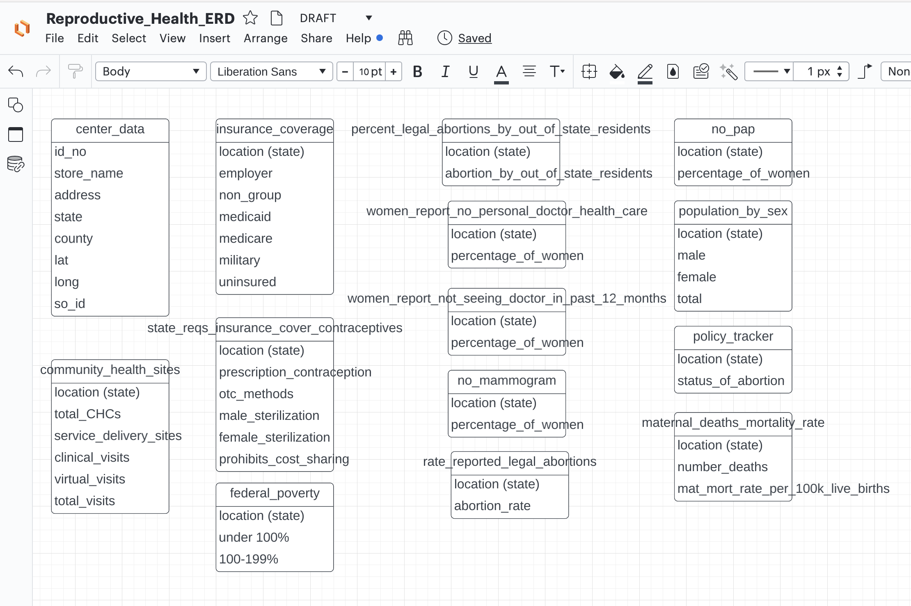

# Technologies Used
## Data Cleaning and Analysis
Python and Pandas will be used to clean the data and perform an analysis. 

## Database Storage
Postgres is the database we intend to use for clean data storage. We will use PySpark to interact with and display the data.

## Machine Learning
We will use Scikit-learn's LabelEncoder module for the encoding step of prepocessing to convert categorical and text data into numerical data so that it is usable for machine learning models. For the scaling step of preprocessing, we'll use Scikit-learn's StandardScaler module.

To cluster we will use SciKit-Learn's K-means to cluster and use plotly to visualize results. After the adequate cluster is identified, it will be used for the multivariate regression 
with SciKit-Learn's Train Test Split and plotly for futher visualization.

## Dashboard
We will use Tableau to visualize our data and create an interactive dashboard that displays counties in need of a reproductive health clinic. The county information supplied to the user will also include House Representative contact information and a call to action to reach out to local Representatives to demand change. Our dashboard will allow users to download data for their region to share with their Representatives.

## Group Collaboration
Throughout the project, our team will use GitHub to create a shared repository for all team members to contribute as well as peer review and edit each others' work. To create our ERD, we will use LucidChart to set up the database structure and how different data tables will tie together. 

|*LucidChart ERD*|
|:--:|
||

Finally, we will use Google Jamboard to document tasks needed to accomplish for each segment. 
|*First Segment Jamboard*|
|:--:|
||

## Final Presentation
Our final presentation will be created in Google Slides and will include snippets of data and the dashboard we create as well as links to access the dashboard. 